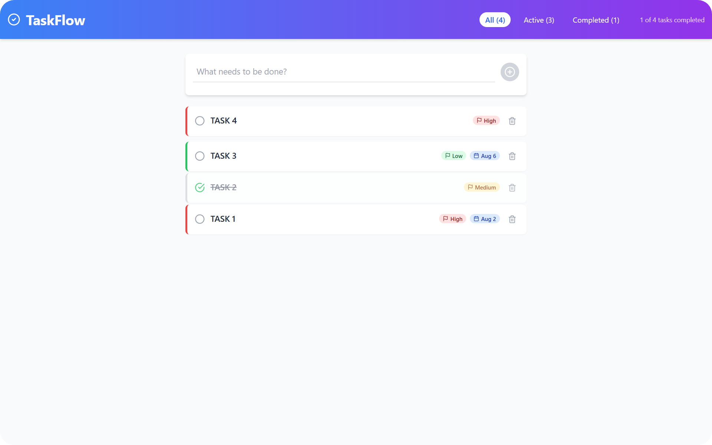

# ✒️ TaskFlow - Modern Todo Application

A beautiful, feature-rich todo application built with React, TypeScript, and Tailwind CSS. TaskFlow helps you organize your tasks with priority levels, due dates, and an intuitive interface designed for productivity.

---




🔗 **Live Demo**: [https://startling-souffle-5f1ba5.netlify.app](https://startling-souffle-5f1ba5.netlify.app/)

---

## ✨ Features

### Core Functionality
- ✅ **Task Management** - Create, edit, and organize tasks with titles and descriptions
- 🎯 **Priority System** - Categorize tasks by Low, Medium, and High priority levels
- 📅 **Due Date Tracking** - Set deadlines with visual overdue indicators
- ✔️ **Completion Tracking** - Mark tasks complete with satisfying animations
- 🗑️ **Smart Deletion** - Remove tasks with confirmation-based interaction
- 🔍 **Advanced Filtering** - View All, Active, or Completed tasks instantly

### User Experience
- 📱 **Fully Responsive** - Seamless experience across mobile, tablet, and desktop
- 🎨 **Modern Design** - Clean interface with gradient headers and card-based layouts
- ⚡ **Smooth Animations** - Thoughtful micro-interactions and transitions
- 💾 **Auto-Save** - Tasks automatically persist to browser storage
- 📊 **Progress Insights** - Real-time statistics and completion tracking
- 🚀 **Performance Optimized** - Fast loading and smooth interactions

## 🛠️ Tech Stack

- **Frontend:** React 18 with TypeScript for type safety
- **Build Tool:** Vite for lightning-fast development
- **Styling:** Tailwind CSS for utility-first styling
- **Icons:** Lucide React for consistent iconography
- **Storage:** Browser Local Storage for data persistence
- **Linting:** ESLint with TypeScript support

## 📦 Quick Start

### Prerequisites
- Node.js 16+ and npm

### Installation

1. **Clone the repository**
   ```bash
   git clone https://github.com/abhishekkalme/TaskFlow-Modern-Todo-Application.git

   cd TaskFlow-Modern-Todo-Application
   ```

2. **Install dependencies**
   ```bash
   npm install
   ```

3. **Start development server**
   ```bash
   npm run dev
   ```

4. **Open in browser**
   Navigate to `http://localhost:5173`

### Production Build

```bash
# Build optimized production bundle
npm run build

# Preview production build locally
npm run preview
```

## 📁 Project Architecture

```
src/
├── components/          # Reusable UI components
│   ├── Header.tsx      # Navigation and filtering interface
│   ├── TaskForm.tsx    # Task creation with advanced options
│   ├── TaskItem.tsx    # Individual task display and actions
│   └── TaskList.tsx    # Task collection with empty states
├── hooks/              # Custom React hooks
│   └── useTasks.ts     # Task state management and operations
├── types/              # TypeScript definitions
│   └── index.ts        # Task and application types
├── utils/              # Helper functions
│   └── storage.ts      # Local storage abstraction
├── App.tsx             # Root application component
├── main.tsx           # Application entry point
└── index.css          # Global styles and animations
```

## 🎯 Component Overview

### TaskForm Component
- **Expandable Interface:** Basic input expands to show advanced options
- **Priority Selection:** Visual priority buttons with color coding
- **Date Validation:** Due date picker with minimum date constraints
- **Form Management:** Auto-reset and validation handling

### TaskItem Component
- **Visual Hierarchy:** Priority-based border colors and indicators
- **Status Management:** Completion toggles with smooth animations
- **Date Handling:** Due date display with overdue alerts
- **Action Confirmation:** Two-step deletion process for safety

### Header Component
- **Real-time Stats:** Live task counts and completion percentages
- **Filter Controls:** Intuitive filter buttons with active states
- **Responsive Layout:** Mobile-first design with breakpoint optimization
- **Progress Display:** Visual completion tracking

## 🔧 Available Commands

| Command | Description |
|---------|-------------|
| `npm run dev` | Start development server with hot reload |
| `npm run build` | Create optimized production build |
| `npm run preview` | Preview production build locally |
| `npm run lint` | Run ESLint for code quality checks |

## 🎨 Design System

### Color Palette
- **Primary:** Blue gradient (`from-blue-500 to-purple-600`)
- **Priority Colors:** Green (low), Amber (medium), Red (high)
- **Neutral Tones:** Gray scale for text and backgrounds
- **Status Colors:** Success, warning, and error states

### Typography
- **Font Stack:** System fonts for optimal performance
- **Hierarchy:** Clear heading and body text distinction
- **Line Height:** 150% for body text, 120% for headings
- **Weight Variation:** Regular, medium, and bold weights

### Spacing System
- **Base Unit:** 8px grid system for consistent spacing
- **Component Padding:** Consistent internal spacing
- **Layout Margins:** Responsive margin scaling
- **Visual Rhythm:** Harmonious vertical spacing

## 📱 Responsive Design

| Breakpoint | Width | Layout |
|------------|-------|--------|
| Mobile | < 768px | Single column, touch-optimized |
| Tablet | 768px - 1024px | Optimized for medium screens |
| Desktop | > 1024px | Full-width with hover states |

## 🔮 Roadmap

### Phase 1 - Core Enhancements
- [ ] Task categories and custom tags
- [ ] Advanced search and filtering
- [ ] Bulk task operations
- [ ] Keyboard shortcuts

### Phase 2 - Advanced Features
- [ ] Drag and drop task reordering
- [ ] Task templates and recurring tasks
- [ ] Data export/import functionality
- [ ] Offline support with service workers

### Phase 3 - Collaboration
- [ ] Multi-user support
- [ ] Real-time synchronization
- [ ] Team workspaces
- [ ] Activity tracking

### Phase 4 - Integrations
- [ ] Calendar integration
- [ ] Email notifications
- [ ] Third-party app connections
- [ ] API development

## 🤝 Contributing

We welcome contributions! Please follow these steps:

1. **Fork** the repository
2. **Create** a feature branch (`git checkout -b feature/amazing-feature`)
3. **Commit** your changes (`git commit -m 'Add amazing feature'`)
4. **Push** to the branch (`git push origin feature/amazing-feature`)
5. **Open** a Pull Request

### Development Guidelines
- Follow existing code style and conventions
- Add TypeScript types for new features
- Include responsive design considerations
- Test across different browsers and devices
- Update documentation for new features

## 📄 License

This project is licensed under the MIT License - see the [LICENSE](LICENSE) file for complete details.

## 🙏 Acknowledgments

- **Icons:** [Lucide React](https://lucide.dev/) for beautiful, consistent icons
- **Styling:** [Tailwind CSS](https://tailwindcss.com/) for utility-first CSS
- **Build Tool:** [Vite](https://vitejs.dev/) for fast development experience
- **Framework:** [React](https://reactjs.org/) for component-based architecture
- **Images:** [Pexels](https://pexels.com/) for high-quality stock photography

## 📞 Support

- **Issues:** [GitHub Issues](https://github.com/abhishekkalme/TaskFlow-Modern-Todo-Application/issues)
- **Discussions:** [GitHub Discussions](https://github.com/abhishekkalme/TaskFlow-Modern-Todo-Application/discussions)
- **Email:** abhishekkalme0@gmail.com

---

**Built with ❤️ and modern web technologies**

⭐ **Star this repository if TaskFlow helps you stay organized!**

[](https://github.com/abhishekkalme/TaskFlow-Modern-Todo-Application/stargazers)
[](https://github.com/abhishekkalme/TaskFlow-Modern-Todo-Application/network)
[](https://github.com/abhishekkalme/TaskFlow-Modern-Todo-Application/issues)
